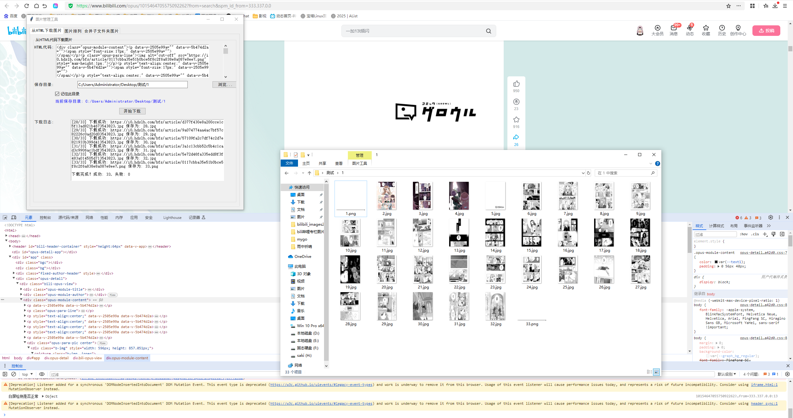
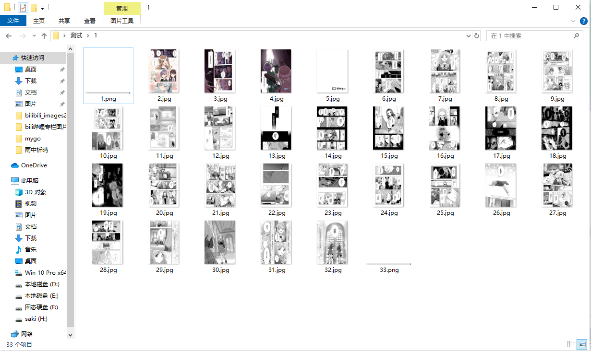
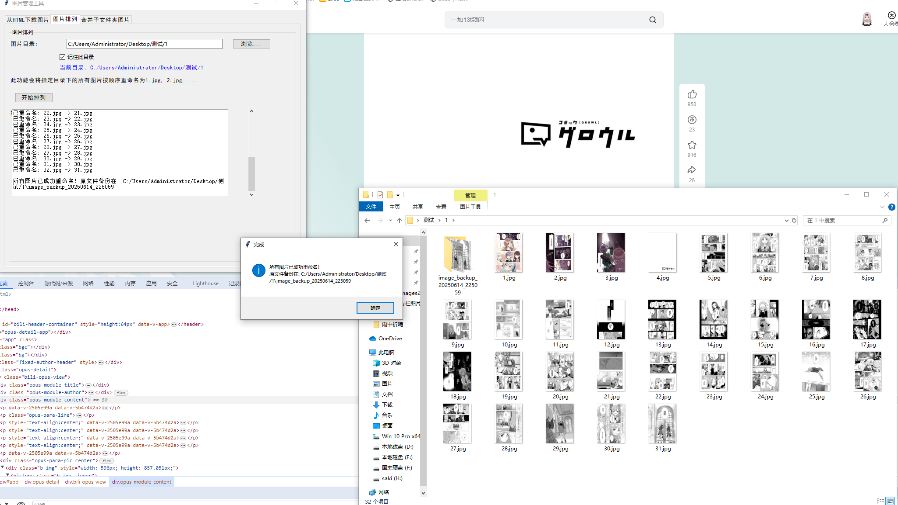

# html-img-download

粘贴html代码，自动下载html内的所有图片的原图而不是被压缩格式的图片。  

## 功能展示  

### 1. 粘贴HTML代码并下载图片  
  
**描述**：在输入框中粘贴包含图片的HTML代码，点击下载按钮即可获取所有图片的原图，绕过网站的压缩格式。  

### 2. 移除无关图片并重新排列  
  
**描述**：选中并移除两张无关图片后，剩余图片按序号重新排列命名，使文件结构更清晰。  

### 3. 合并子文件夹图片到新目录  
  
**描述**：将总文件夹下所有子文件夹中的图片合并到"合集"目录，并按顺序统一排列编号。  

## 使用说明  
1. 克隆仓库后安装依赖：`pip install requests beautifulsoup4`  
2. 运行程序并根据标签页提示操作  
3. 图片将保存至指定目录，支持自定义命名规则  
